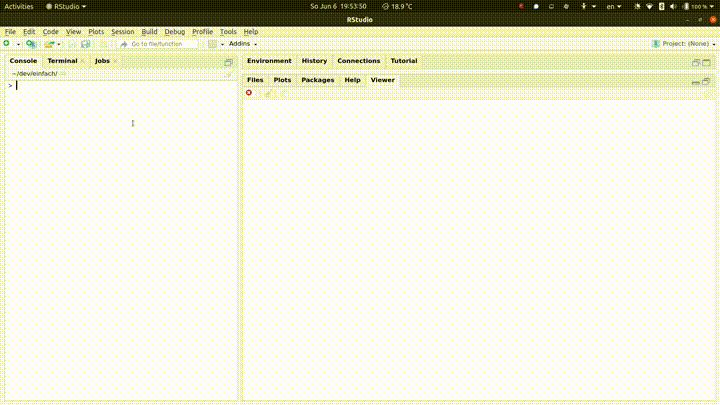

<!-- README.md is generated from README.Rmd. Please edit that file -->

```{r, include = FALSE}
knitr::opts_chunk$set(
  collapse = TRUE,
  comment = "#>",
  fig.path = "man/figures/README-",
  out.width = "100%"
)
```

# einfach

<!-- badges: start -->
[](https://github.com/chainsawriot/einfach/actions)
<!-- badges: end -->

The goal of einfach is to make collecting tweets through the Academic Research Product Track V2 API as simple as possible. This package is inspired by [Facepager](https://github.com/strohne/Facepager) (Jünger & Keyling, 2019). But the author of this package doesn't have the talent to clone it accurately, and thus **e**infach **i**s **n**ot **F**acepager's **a**ccurate **c**lone, **h**onestly.

## Installation

You can install the development version of einfach from Github with:

``` r
devtools::install_github("chainsawriot/einfach")
```

## Usage

1. You need to have access to the Academic Research Product Track V2 API. Please refer to the [academictwitteR's vignette](https://cran.r-project.org/web/packages/academictwitteR/vignettes/academictwitteR-auth.html) for more information.

2. Please setup your bearer token according to the instructions in `?get_bearer()`.

You can do that either by inserting this line in either your `.Renviron` (You can edit your `.Renviron` using `usethis::edit_r_environ()`.)

```
TWITTER_BEARER="BABABABABABA"
```

Advance users might know that you can also insert this line in your `~/*rc` (e.g. `~/.bashrc` or `~/.zshrc`) to get the same result.

```sh
export TWITTER_BEARER="BABABABABABABA"
```

3. Launch einfach

```r
require(einfach)
einfach()
```

4. Use the GUI and enjoy!



If you want to know how to build a query, please read this guide from [Twitter](https://developer.twitter.com/en/docs/twitter-api/tweets/search/integrate/build-a-query).

### The dumped data

At the moment, this package will only dump the tweet data.

The dumped data is a tibble and look like so:

```{r, include = FALSE}
example <- readRDS(system.file("extdata", "example_data.RDS", package = "einfach"))
```

```{r}
require(tibble)
example
```

## Contributing

Contributions in the form of feedback, comments, code, and bug report are welcome.

* Fork the source code, modify, and issue a [pull request](https://docs.github.com/en/github/collaborating-with-issues-and-pull-requests/creating-a-pull-request-from-a-fork).
* Issues, bug reports: [File a Github issue](https://github.com/chainsawriot/einfach).
* Github is not your thing? Contact Chung-hong Chan by e-mail, post, or other methods listed on this [page](https://www.mzes.uni-mannheim.de/d7/en/profiles/chung-hong-chan).

## Code of Conduct

Please note that the einfach project is released with a [Contributor Code of Conduct](https://contributor-covenant.org/version/2/0/CODE_OF_CONDUCT.html). By contributing to this project, you agree to abide by its terms.

---
