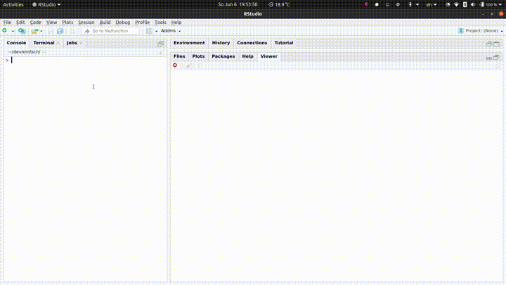

<!-- README.md is generated from README.Rmd. Please edit that file -->

# einfach 

<!-- badges: start -->

[](https://github.com/chainsawriot/einfach/actions)
<!-- badges: end -->

The goal of einfach is to make collecting tweets through the Academic
Research Product Track V2 API as simple as possible. This package is
inspired by [Facepager](https://github.com/strohne/Facepager) (Jünger &
Keyling, 2019). But the author of this package doesn’t have the talent
to clone it accurately, and thus **e**infach **i**s **n**ot
**F**acepager’s **a**ccurate **c**lone, **h**onestly.

## Installation

You can install the development version of einfach from Github with:

``` r
devtools::install_github("chainsawriot/einfach")
```

## Usage

1.  You need to have access to the Academic Research Product Track V2
    API. Please refer to the [academictwitteR’s
    vignette](https://cran.r-project.org/web/packages/academictwitteR/vignettes/academictwitteR-auth.html)
    for more information.

2.  Please setup your bearer token according to the instructions in
    `?get_bearer()`.

You can do that either by inserting this line in either your `.Renviron`
(You can edit your `.Renviron` using `usethis::edit_r_environ()`.)

    TWITTER_BEARER="BABABABABABA"

Advance users might know that you can also insert this line in your
`~/*rc` (e.g. `~/.bashrc` or `~/.zshrc`) to get the same result.

``` sh
export TWITTER_BEARER="BABABABABABABA"
```

3.  Launch einfach

<!-- end list -->

``` r
require(einfach)
einfach()
```

4.  Use the GUI and enjoy\!



If you want to know how to build a query, please read this guide from
[Twitter](https://developer.twitter.com/en/docs/twitter-api/tweets/search/integrate/build-a-query).

### The dumped data

You can dump the collected data as either Serialized R Object (RDS),
Comma-seperated data (CSV), Excel (xlsx), Stata (dta) or SPSS (sav).

The format is the so-called “tidy” format like the one below

``` r
require(tibble)
#> Loading required package: tibble
example
#> # A tibble: 857 x 31
#>    tweet_id   user_username  text          lang  source   author_id  created_at 
#>    <chr>      <chr>          <chr>         <chr> <chr>    <chr>      <chr>      
#>  1 136537201… RutgersCommIn… "RT @NatComm… en    Twitter… 52517689   2021-02-26…
#>  2 136536853… NatComm        "NCA invites… en    Twitter… 17880989   2021-02-26…
#>  3 136533671… ElizabethAHin… "Always happ… en    Twitter… 116490404… 2021-02-26…
#>  4 136519974… quinnli725     "RT @judith_… en    Twitter… 781327782… 2021-02-26…
#>  5 136512063… lizbmarquis    "RT @disable… en    Twitter… 982724506… 2021-02-26…
#>  6 136507685… jlinabary      "RT @disable… en    Twitter… 16538343   2021-02-25…
#>  7 136506714… egerphd        "RT @disable… en    Twitter… 102731352… 2021-02-25…
#>  8 136506497… MrSulaimanKhan "RT @disable… en    Twitter… 213644552  2021-02-25…
#>  9 136506486… wunpini_fm     "RT @disable… en    Twitter… 460255655  2021-02-25…
#> 10 136506462… disabledphd    "Hey #CommTw… en    Twitter… 118480786… 2021-02-25…
#> # … with 847 more rows, and 24 more variables: conversation_id <chr>,
#> #   possibly_sensitive <lgl>, in_reply_to_user_id <chr>, user_location <chr>,
#> #   user_description <chr>, user_created_at <chr>,
#> #   user_profile_image_url <chr>, user_name <chr>, user_verified <lgl>,
#> #   user_url <chr>, user_protected <lgl>, user_pinned_tweet_id <chr>,
#> #   retweet_count <int>, like_count <int>, quote_count <int>,
#> #   user_tweet_count <int>, user_list_count <int>, user_followers_count <int>,
#> #   user_following_count <int>, sourcetweet_type <chr>, sourcetweet_id <chr>,
#> #   sourcetweet_text <chr>, sourcetweet_lang <chr>, sourcetweet_author_id <chr>
```

With the following columns

``` r
colnames(example)
#>  [1] "tweet_id"               "user_username"          "text"                  
#>  [4] "lang"                   "source"                 "author_id"             
#>  [7] "created_at"             "conversation_id"        "possibly_sensitive"    
#> [10] "in_reply_to_user_id"    "user_location"          "user_description"      
#> [13] "user_created_at"        "user_profile_image_url" "user_name"             
#> [16] "user_verified"          "user_url"               "user_protected"        
#> [19] "user_pinned_tweet_id"   "retweet_count"          "like_count"            
#> [22] "quote_count"            "user_tweet_count"       "user_list_count"       
#> [25] "user_followers_count"   "user_following_count"   "sourcetweet_type"      
#> [28] "sourcetweet_id"         "sourcetweet_text"       "sourcetweet_lang"      
#> [31] "sourcetweet_author_id"
```

## Contributing

Contributions in the form of feedback, comments, code, and bug report
are welcome.

  - Fork the source code, modify, and issue a [pull
    request](https://docs.github.com/en/github/collaborating-with-issues-and-pull-requests/creating-a-pull-request-from-a-fork).
  - Issues, bug reports: [File a Github
    issue](https://github.com/chainsawriot/einfach).
  - Github is not your thing? Contact Chung-hong Chan by e-mail, post,
    or other methods listed on this
    [page](https://www.mzes.uni-mannheim.de/d7/en/profiles/chung-hong-chan).

## Code of Conduct

Please note that the einfach project is released with a [Contributor
Code of
Conduct](https://contributor-covenant.org/version/2/0/CODE_OF_CONDUCT.html).
By contributing to this project, you agree to abide by its terms.

-----
